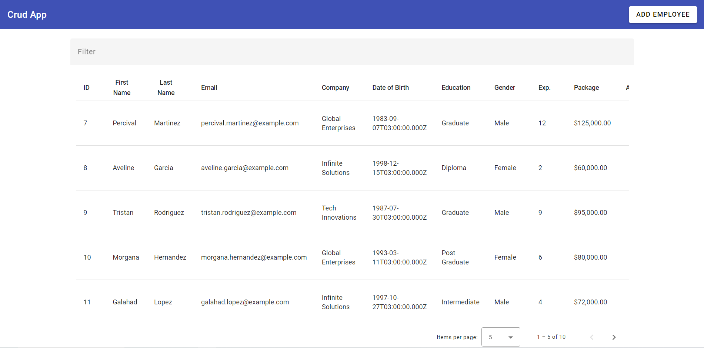
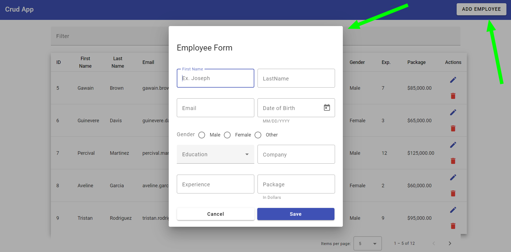
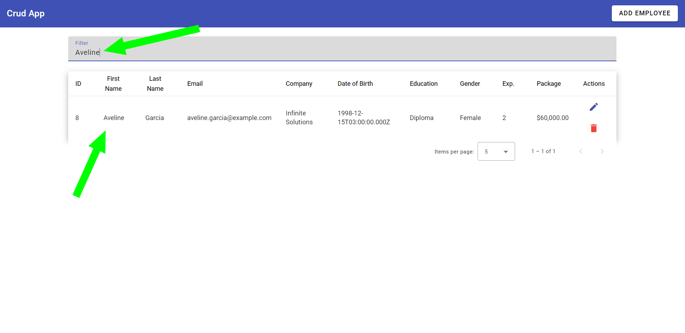
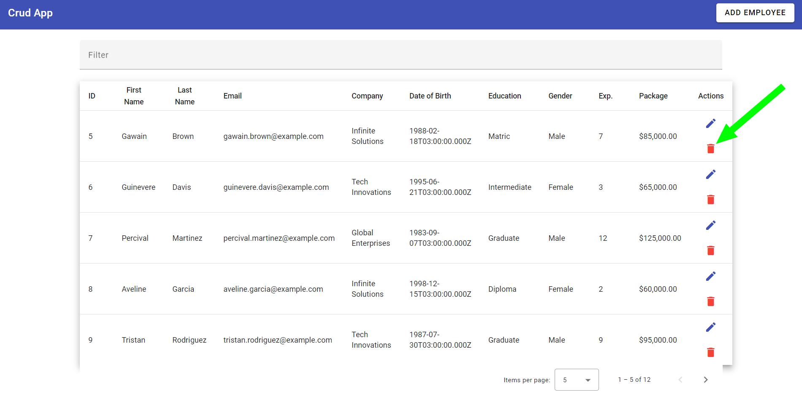
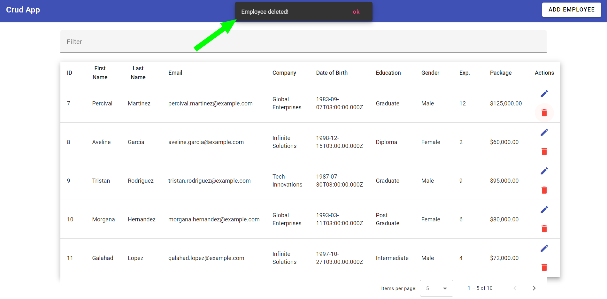

<div style="text-align: center;"> 
    <h1>Employee CRUD</h1>
</div> 
 


<div style="display: flex; align-items: center; justify-content: center; gap: 5px;"> 
</img>
</img>
</img>
  
   
 </div> 
 <div style="margin: 10px;"> 
    
</div>

# Sumary

1. [Introduction](#introduction)
2. [Installation](#installation)
   - [Warning](#warning)
   - [Installation of Angular CLI](#installation-of-angular-cli)
   - [Cloning the repository](#cloning-the-repository)
   - [Installation of Dependencies](#installation-of-dependencies)
3. [Execution](#execution)
   - [Initialize the DB.JSON](#initialize-the-dbjson)
   - [Initialize the local server](#initialize-the-local-server)
4. [Components](#components)
   - [app.component](#appcomponent)
   - [emp-add-edit](#emp-add-edit)
   - [Core](#core)
5. [CLI Version](#cli-version)
6. [Final Considerations](#final-considerations)

# Introduction:

### In this project we've a simple crud that can do the following operations:

- ### Get
- ### Post
- ### Update
- ### Delete

### As a database, we use the db.json, that is more simple an efficient for simple projects.

### The user interface for manipulation of CRUD is based on a table and dialog-form model.

---

# Installation:

## Warning:

### For run this project you'll must have the <a href="https://nodejs.org/en">nodejs</a> and npm installed in your machine.

### I recomment that you use visual studio core as a code editor because the documentation is based on it, but you're free to choice your code editor.

## Installation of Angular CLI:

### To install the Angular CLI, open a terminal with VSCODE and type:

```powershell
npm install -g @angular/cli
```

##  Cloning the repository:

### To clone this repository, open the terminal and find the root directory of your project and run it to initialize a local repository:

```bash
git init
```

### After this run it to clone this repository:

```bash
git clone https://github.com/EvertonMLGoncalves/crud-employee
```

## Installation of Dependencies:

### To install the dependencies open the file of the project and run it in a terminal:

```bash
npm install
```

---

# Execution:

## Initialize the DB.JSON:

### To initialize the DB.JSON run this in a terminal:

```bash
json-server -w db.json
```

## Initialize the local server:

```bash
ng-serve -o
```

---

# Components:

## app.component

- ### This component has most of the code. It contains all other components. It is also rendered in the `index.html` file, rendering all other components per chain.
- ### It also contain the principal table that has the sorting funtionality. This table is part of angular material.
- ### In its TypeScript file, we have the `AppComponent` `Class` that implements the interfaces `OnInit` and `AfterViewInit`
- ### As fields of the class, we have the `tittle`, `displayedColums` that indicates what will be the table columus, `dataSource` that stores the `MatDataTable` data and two `decorators` `sort`and `paginator`
- ### In the `constructor` of the class, we have `three instances`: `_dialog : MatDialog`, ` _empService: EmployeeService` and `_coreService : CoreService`.
- ### The method `ngOnInit` calls the method `getEmployeeList` before the component be started.
- ### The method `getEmployeeList` calls the method `getEmployee` of the `_empService` and fill the `dataSource` with the response of `getEmployee`.
- ### The method `openAddEditEmpForm` open uses the `_dialog` and open the dialog that is use as a add and update form.



- ### The method `applyFilter` apply to `dataSource.filter` the current value typed on the filter input and if there is `match` in the `database`, the `table` will show the `match`



- ### The method `deleteEmployee` calls the `_empService` and deletes the employee in the table. It also call the `_coreService` to open a `snack bar` of `angular material`




- ### The method `openEditForm` calls `_dialog` to open the form that is a `dialog`.

## emp-add-edit

- ### This component contains the `form` that is use to `add` and `edit` the employees.
- ### Its `form` its `based` on `angular material` `inputs` ands `buttons`.
- ### on its `TypeScript` file, we have the class `EmpAddEditComponent` that `implements` the interface `OnInit`
- ### As the filds of the class, we have the `empForm : FormGroup` and `Education` that contains `strings` of each `degree` of that is used on a `select menu` in the `HTML` file.
- ### In its `constructor` there are four instances that are:
  - ### `_fb: FormBuilder`
  - ### `_empService: EmployeeService`
  - ### `_dialogRef: MatDialogRef<EmpAddEditComponent>`
  ### And we have an injection of `MAT_DIALOG_DATA` as `data` and an declaration of `FormGroup` in `empForm`
- ### Its method `ngOnInit` calls the method `patchValue` of `empForm` and fill the form with the current `data`
- ### The method `getData` returns the `data`.
- ### The method `onFormSubmit` is used when the button `save` or `update` is trigged. If the form has values, it calls the method `updateEmp` else it calls `addEmp`.
- ### The method `addEmp` calls the method `addEmployee` of `_empService` and adds an employee. It also open a `snack bar` warning that an employee was added.
- ### The method `updateEmployee` calls the method `updateEmployee` of `_empService` and update the employee's data. It also open a `snack bar` warning that an employes's data was updated.

## Core

- ### The `core component` has the class `CoreService` that is responsible for the `snack bar`
- ### In the `constructor` of the `CoreService` there is a instance of `_snackBar: MatSnackBar`
- ### The method `openSnackBar` calls the method `open` of `_snackBar` that opens an snack bar with a `message`, an `action` - sets by default as "ok" - and its informations of `duration` and `positionw`

---

# CLI Version

### This project was generated with [Angular CLI](https://github.com/angular/angular-cli) version 16.2.2.

---

# Final Considerations

### This project was made in the +Devs2Blu2023 course with the teacher.
